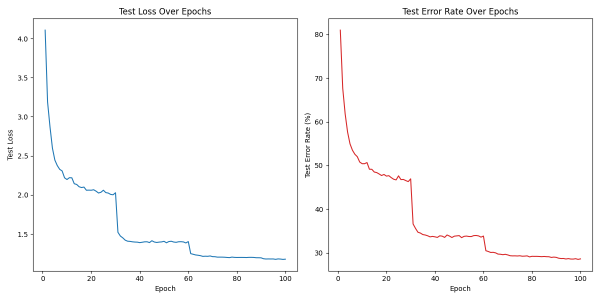

# ImageNet-CUDA

This is a source code written in CUDA/C++ to train ResNet-34 on the ImageNet dataset.

We refered these excellent base codes.

[1] https://github.com/pjreddie/darknet/tree/a3714d0a2bf92c3dea84c4bea65b2b0c64dbc6b1

[2] https://github.com/PacktPublishing/Learn-CUDA-Programming

The training result is as follows:

The learning rate and batch size are not fully tuned.

However, the trained ResNet-34 model reached at the 71.51% accuracy.

It is comparable to the result from Darknet's ResNet-34 (72.4%).

https://pjreddie.com/darknet/imagenet/
